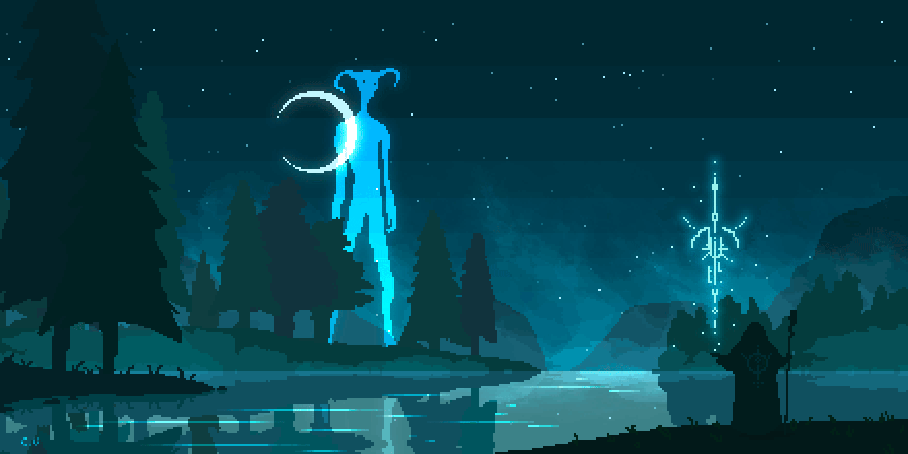

  
  <h1>Hi, I'm Aakash 👋</h1>
  
<i>Cybersecurity (SOC) Learner | Python Automation | Applying ML to Security & Threat Detection</i>

 

    

## 🧑‍💻 About Me

_I’m a B.Tech student specializing in AI & Data Science, focused on building a career in cybersecurity—especially SOC operations, threat detection, and Python-based automation. I actively build security tools, experiment with ML models for anomaly detection, and study log analysis, SIEM workflows, and web security._

_Alongside cybersecurity, I work on full-stack development to stay industry-ready and deliver real, deployable projects. My goal is to combine security, automation, and machine learning to create efficient, scalable, and practical solutions for real-world environments._

---

## 🚀 Tech Stack Experience

  
   
  
  
  
  
  
  

  
  
  
  
  
  
  
  
  
  

---

## 📊 GitHub Stats

   
   
  
   
  

  <!--  -->

  <!--  -->

  
  

## 🌍 Connect With Me

## 🎯 Current Focus

- Strengthening SOC analysis skills and real-time security monitoring
- Improving incident response methodology and threat investigation workflow
- Building Python tools for security automation and log analysis
- Enhancing skills in network security, vulnerability assessment, and hardening
- Expanding knowledge in threat intelligence and adversary behavior patterns

 

  

    
  

